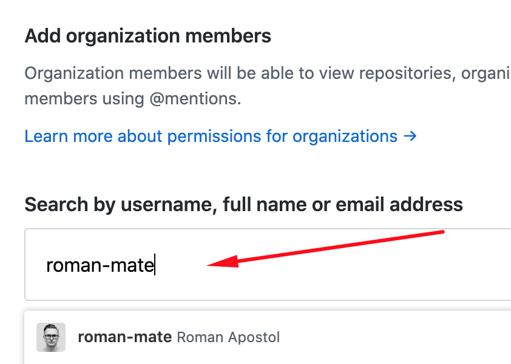

# Task Management System

Manage tasks and projects effectively through a web-based application. This system enables task creation, assignment, progress tracking, and completion. To enhance user experience, users can add attachments directly from Dropbox, making the process seamless.

## If you work in a team

1. Create an organization on GitHub
   
2. Choose a `Free` plan
3. Use a name like `fe-feb20-team0` (your group + your team name)
4. It should belong to your personal account
   
5. Add your teammates to the team by their usernames on Github
   

## Instructions

1. Create a new Spring Boot project
2. Create a new GitHub repo with `car-sharing-app` name (or any other you like)
    - if you work in a team the repo MUST belong to the organization;
    - configure `Branch protection rules` for the organization repository using the following tutorial:

      

        
Tutorial for branch protection rules

      Go to the repository settings
      STEP #1
      

      STEP #2
      

      Add the rule with only next settings
      STEP #3
      

      More information about all other settings at
      the [link](https://docs.github.com/en/repositories/configuring-branches-and-merges-in-your-repository/defining-the-mergeability-of-pull-requests/managing-a-branch-protection-rule)
      

3. Connect a repo to a folder with your Spring Boot project (see the instructions on GitHub);
4. Setup checkstyle plugin in your project
5. Setup CI process to run `mvn clean verify` command by adding a `.github/workflows/ci.yml` file
6. The `master` (or `main`) branch is a base for your feature PullRequests.
7. PRs should be merged there after review

## How to develop a feature

1. `Pull` the latest `master`.
2. Create a `your-feature-name` branch and `push` it to GitHub.
3. Open a Pull Request (`PR`) from your branch to the `master` (`main`).
4. Discuss branches and commits naming practices. Your branch, PR, and commit names should be consistent across the
   team. Example of PR names:
    - [DB]: prefix for liquibase scripts
    - [API] for scripts with api changes
5. Do not use forks, work in single repo altogether!
6. Write your code, save it and push it to GitHub.
7. Ask your teammate to review and approve if everything is OK.
8. If some fixes are required discuss the comments and repeat steps 5-7.
9. Mentors will review your codebase everyday, but not PRs.

## Coding

- Add checkstyle plugin.
- Separate PR to the `main` branch for each task is required.
- 60%+ of the custom code should be covered with tests.
- Make sure to name your commits & branches meaningfully.
- Do not use forks, work in single repo altogether (if you work in a team).

## App

### Requirements:

- Functional (what the system should do):
    - Web-based
    - User registration and authentication
    - Project management (CRUD operations)
    - Task management within projects
    - Assign and notify users about tasks
    - Add comments and attachments to tasks
    - Organize tasks with labels
    - Store attachments on Dropbox using its API
- Non-functional (what the system should deal with):
    - Scalable to handle a large number of users
    - Efficient retrieval of tasks, comments, and attachments
    - Secure storage of sensitive user data

### Models

1. **User**:
    - Username: String
    - Password: String
    - Email: String
    - First Name: String
    - Last Name: String

2. **Project**:
    - Name: String
    - Description: String
    - Start Date: LocalDate
    - End Date: LocalDate
    - Status: Enum: [INITIATED, IN_PROGRESS, COMPLETED]

3. **Task**:
    - Name: String
    - Description: String
    - Priority: Enum: [LOW, MEDIUM, HIGH]
    - Status: Enum: [NOT_STARTED, IN_PROGRESS, COMPLETED]
    - Due Date: LocalDate
    - Project ID: Long
    - Assignee ID: Long

4. **Comment**:
    - Task ID: Long
    - User ID: Long
    - Text: String
    - Timestamp: LocalDateTime

5. **Attachment**:
    - Task ID: Long
    - Dropbox File ID: String   // Store the reference to Dropbox
    - Filename: String
    - Upload Date: LocalDateTime

6. **Label**:
    - Name: String
    - Color: String

### Controllers

1. **Auth Controller**:
    - POST: /api/auth/register - User registration
    - POST: /api/auth/login - User authentication

2. Users Controller: Managing authentication and user registration
    - PUT: /users/{id}/role - update user role
    - GET: /users/me - get my profile info
    - PUT/PATCH: /users/me - update profile info

3. **Project Controller**:
    - POST: /api/projects - Create a new project
    - GET: /api/projects - Retrieve user's projects
    - GET: /api/projects/{id} - Retrieve project details
    - PUT: /api/projects/{id} - Update project
    - DELETE: /api/projects/{id} - Delete project

4. **Task Controller**:
    - POST: /api/tasks - Create a new task
    - GET: /api/tasks - Retrieve tasks for a project
    - GET: /api/tasks/{id} - Retrieve task details
    - PUT: /api/tasks/{id} - Update task
    - DELETE: /api/tasks/{id} - Delete task

5. **Comment Controller**:
    - POST: /api/comments - Add a comment to a task
    - GET: /api/comments?taskId={taskId} - Retrieve comments for a task

6. **Attachment Controller**:  // This is where we will interact with Dropbox API
    - POST: /api/attachments - Upload an attachment to a task (File gets uploaded to Dropbox and we store the Dropbox File ID in our database)
    - GET: /api/attachments?taskId={taskId} - Retrieve attachments for a task (Get the Dropbox File ID from the database and retrieve the actual file from Dropbox)

7. **Label Controller**:
    - POST: /api/labels - Create a new label
    - GET: /api/labels - Retrieve labels
    - PUT: /api/labels/{id} - Update label
    - DELETE: /api/labels/{id} - Delete label

### Dropbox Integration:

To store the attachments of tasks, we will use the Dropbox API. The general flow is:

1. When a user uploads an attachment, our backend will upload this file to Dropbox.
2. Dropbox returns a unique File ID after a successful upload.
3. We store this Dropbox File ID in our database against the attachment details.
4. When someone wants to retrieve/download the attachment, we use this File ID to fetch the file from Dropbox and serve it to the user.

This approach allows us to leverage Dropbox's robust file storage system, keeping our system lightweight and focused on task management.

Read more about [Dropbox API](./dropbox.md)

## Tasks

### Infrastructure

- Set up a task management board on a platform like Trello or Jira to keep track of progress.
- Initialize a new repository on GitHub or another platform for source code version control.
- Set up a CI/CD process to automate testing and deployment.
- Integrate a database migration tool, e.g., Liquibase or Flyway, to handle database schema changes.
- Add a health check endpoint to ensure the application is running and connected to the database.
- Containerize the application using Docker to ensure a consistent runtime environment.
- Store sensitive information such as API keys in a `.env` file, and add a `.env.sample` with placeholders to the repository.
- Implement API documentation using tools like Swagger to provide an interactive interface for testing and understanding the API.
- Update the `README.md` with setup instructions, API endpoints, and other relevant information once the project is complete.

### User Management

- Implement user registration and authentication mechanisms.
- Add user roles and permissions (e.g., ADMIN, USER) to control access to certain functionalities.
- Secure API endpoints using JWT tokens or other security mechanisms.

### Project Management

- Set up database tables and JPA entities for projects.
- Implement CRUD operations for projects.
- Ensure only authorized users can access, modify, or delete projects.

### Task Management

- Create tables and entities for tasks.
- Implement CRUD operations for tasks.
- Allow tasks to be assigned to users and notify assignees of new tasks.

### Comments

- Set up tables and entities for comments.
- Allow users to add, view, and delete comments related to tasks.

### Attachments

- Design the attachment entity to store metadata about files (filename, upload date, etc.), but the actual files will be stored on Dropbox.
- Integrate with the Dropbox API to upload, retrieve, and delete files.
    - When a new attachment is uploaded, save it to Dropbox and store the returned metadata in the application database.
    - For retrieval, fetch the metadata from the database and use the Dropbox API to fetch the actual file.
    - Deleting an attachment should remove the metadata from the database and also delete the file from Dropbox.
- Ensure only authorized users can upload, view, or delete attachments.

### Labels

- Implement database tables and entities for labels.
- Allow users to create, modify, and delete labels.
- Allow labels to be assigned to tasks for better organization.

### Notifications
- Integrate a notification system, like email or Telegram, to notify users about task deadlines, comments, and other updates.

### Optional:
- Deploy your app to the AWS

### Advanced
- Implement a search and filter mechanism for tasks and projects.
- Integrate with third-party applications, like Google Calendar, to provide additional functionalities.
